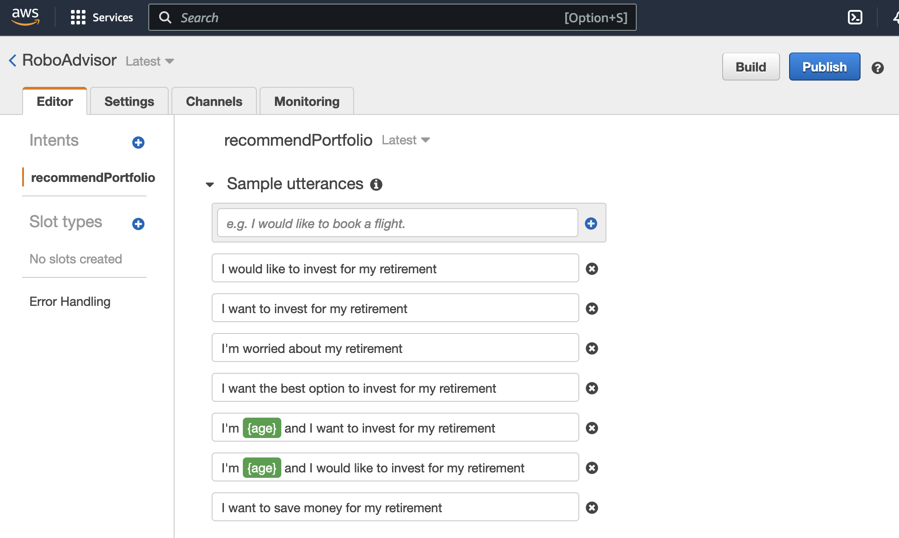
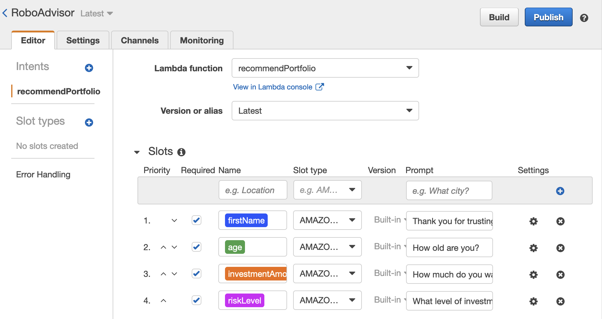

# *Robo advisor with AWS*
---

**Welcome to my repository for the robo advisor with Amazon Web Services. Please explore the codebase!**  

---
## Analytical Summary

The repository presents a robo advisor that applies NLP and ML to recommend an investment portfolio for a retirement plan.

---

## Technologies

The applied technologies are Amazon Lex bot and Amazon Lambda function. The used coding languages are Python 3.7 and JSON.

---

## Usage

To use this project clone the repository, copy the code in **lambda_function.py** and JSON files in the folder Test_Events for the Amazon Lambda function.

---

## Methodology

This project creates a robo advisor that offers inestment portfolio for a retirement plan. The bot is created with help of AWS services.

First, create the robo advisor - the Amazon Lex bot. The Bot name is RoboAdvisor. The intent for this Bot is called recommendPortfolio and the utterances appear as follows:

also define four slots as visible on the next image:

The built robo advisor interacts as following:

Second, build the Amazon Lambda function with the python code from lambda_function.py, also add events from the folder Test_Events.

Finally, integrate the Amazon Lambda function into the robo advisor. The recorded video for the working bot is:

---

## License

MIT

---

 
